<p align="center">
  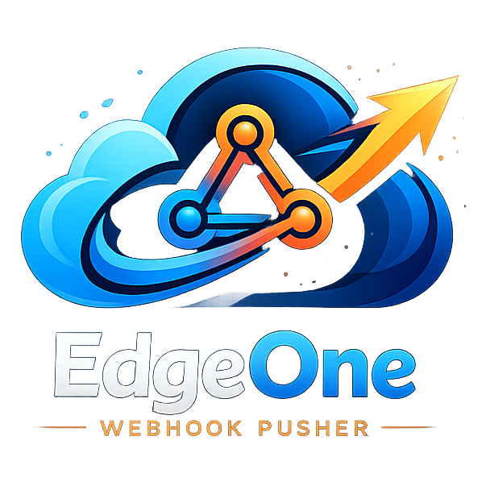
</p>

<h1 align="center">EdgeOne MCP Pusher</h1>

<p align="center">基于 EdgeOne 的自托管免费微信推送与标准 MCP Server</p>

<p align="center">为 Agent、IDE 与 Webhook 工作流提供免费、自托管、可多应用管理的消息推送平台。</p>

> 🚀 **0 成本自建微信推送 + 标准 MCP Server** - 白嫖 EdgeOne + 微信测试号，5 分钟部署专属推送服务

[](https://edgeone.ai/pages/new?template=https://github.com/ixNieStudio/edgeone-mcp-pusher)

**在线体验**：[https://webhook-pusher.ixnie.cn/](https://webhook-pusher.ixnie.cn/)  
体验站仅供试用，生产环境建议自部署。

---

## 为什么选它？

| 对比项 | EdgeOne MCP Pusher | Server 酱 | 认证公众号 |
|--------|--------------------|-----------|------------|
| 成本 | **完全免费** | ¥49/年起 | 需认证费 |
| 数据归属 | **自建自托管** | 第三方托管 | 腾讯托管 |
| 部署方式 | **EdgeOne 一键部署** | 平台现成 | 配置较重 |
| 对 Agent / IDE 友好度 | **标准 MCP Server** | 不支持 | 不标准 |
| 自定义能力 | **完全可控** | 有限 | 有限 |

**核心卖点**：EdgeOne 免费额度 + 微信测试号 + 标准 MCP 接口 = 0 成本长期使用 + 数据自己掌控 + 可被 Agent / IDE 直接识别和调用

> Powered by [Tencent EdgeOne](https://edgeone.ai)

---

## 产品截图

<table>
  <tr>
    <td></td>
    <td>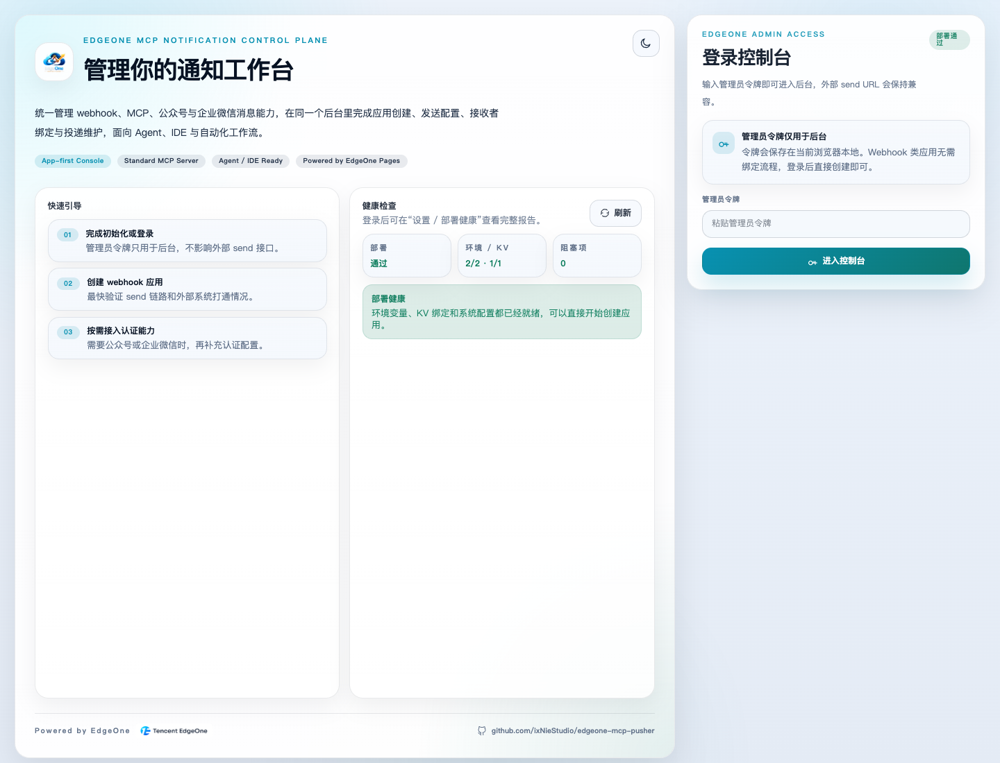</td>
    <td>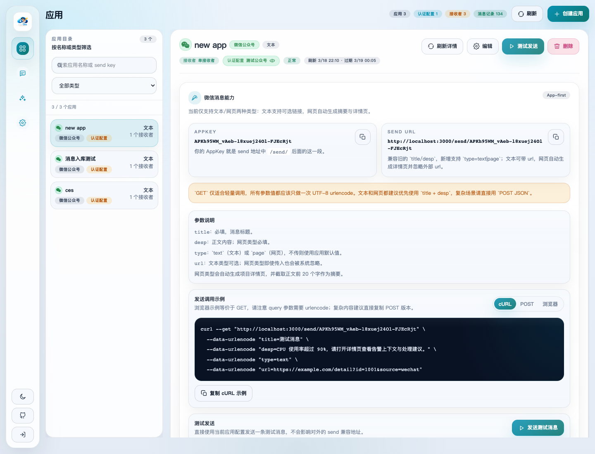</td>
  </tr>
  <tr>
    <td align="center">微信推送效果</td>
    <td align="center">管理台登录</td>
    <td align="center">应用目录与 Send URL</td>
  </tr>
  <tr>
    <td>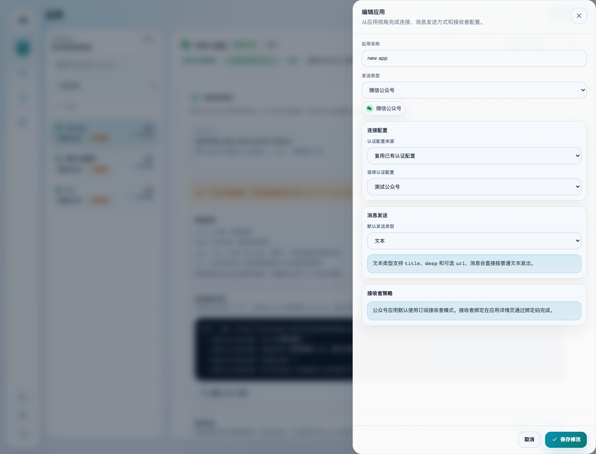</td>
    <td>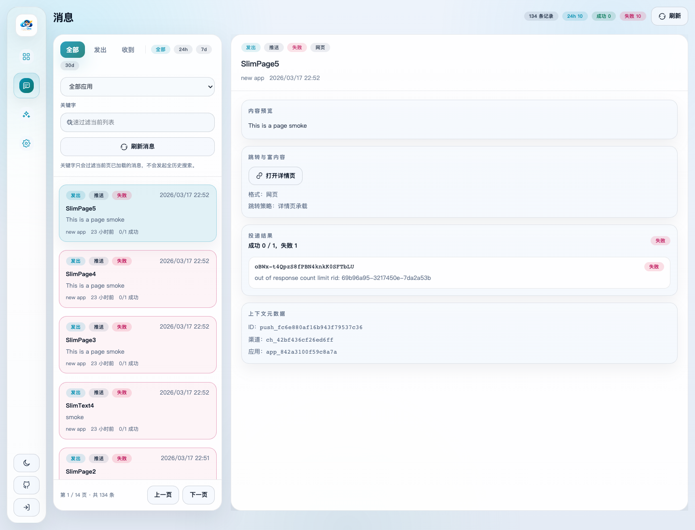</td>
    <td>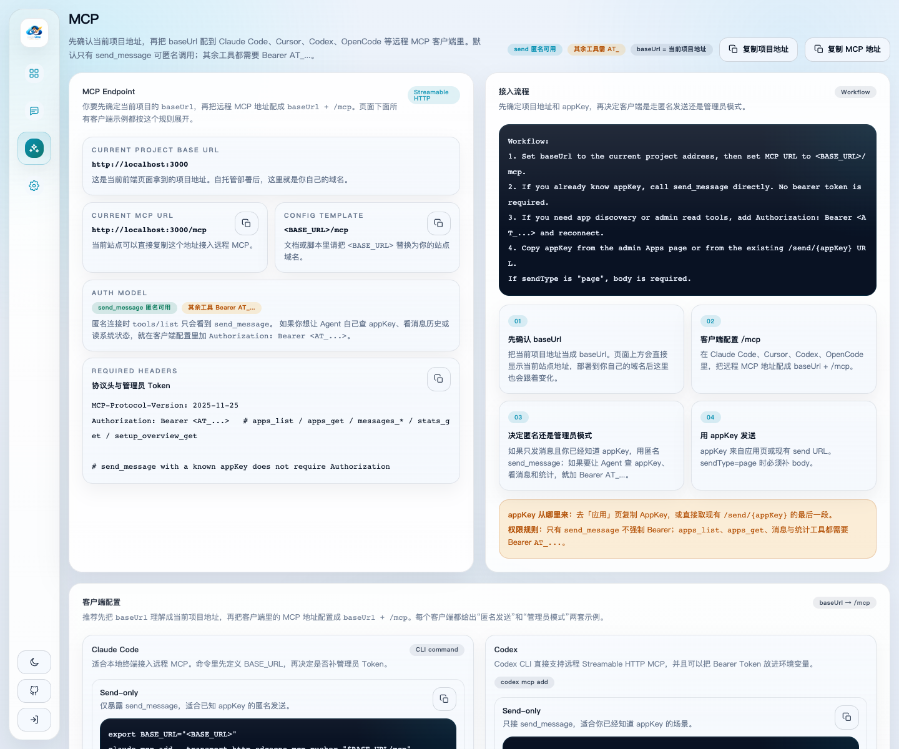</td>
  </tr>
  <tr>
    <td align="center">应用编辑面板</td>
    <td align="center">消息历史与投递详情</td>
    <td align="center">MCP 入口与标准工作流</td>
  </tr>
  <tr>
    <td>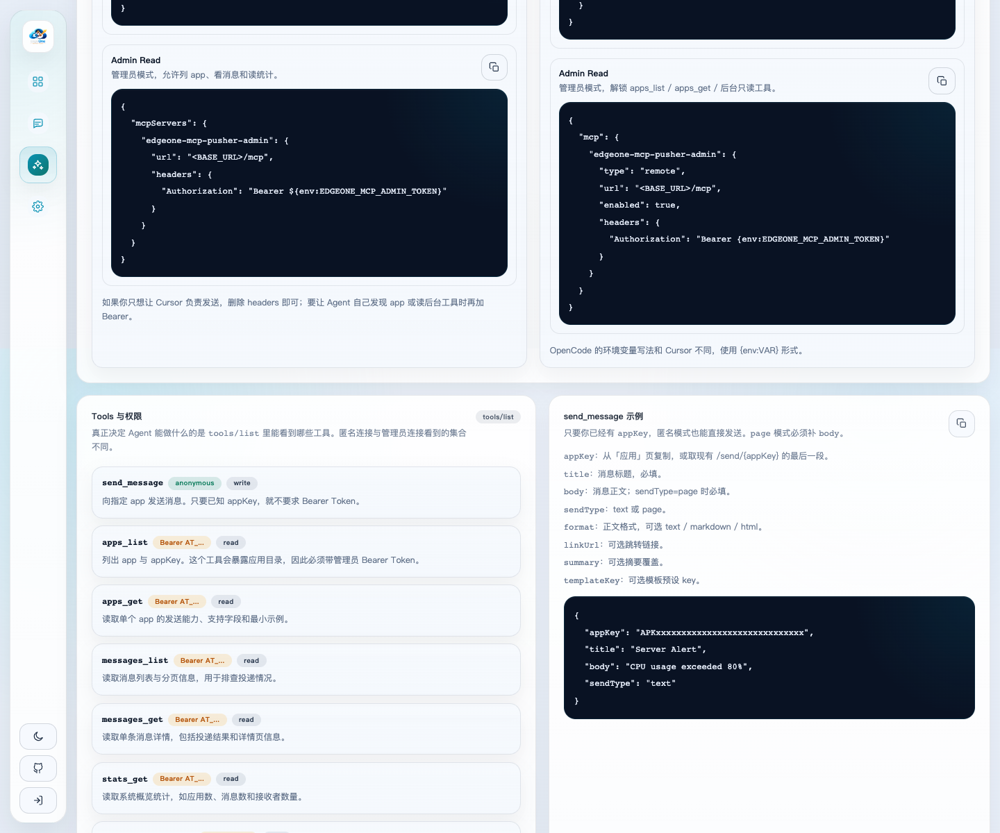</td>
    <td>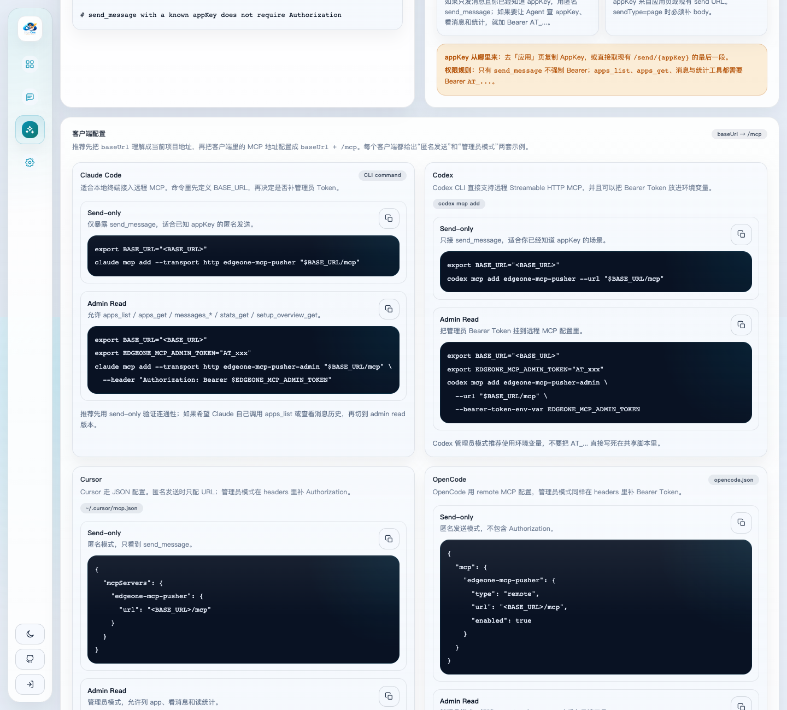</td>
    <td>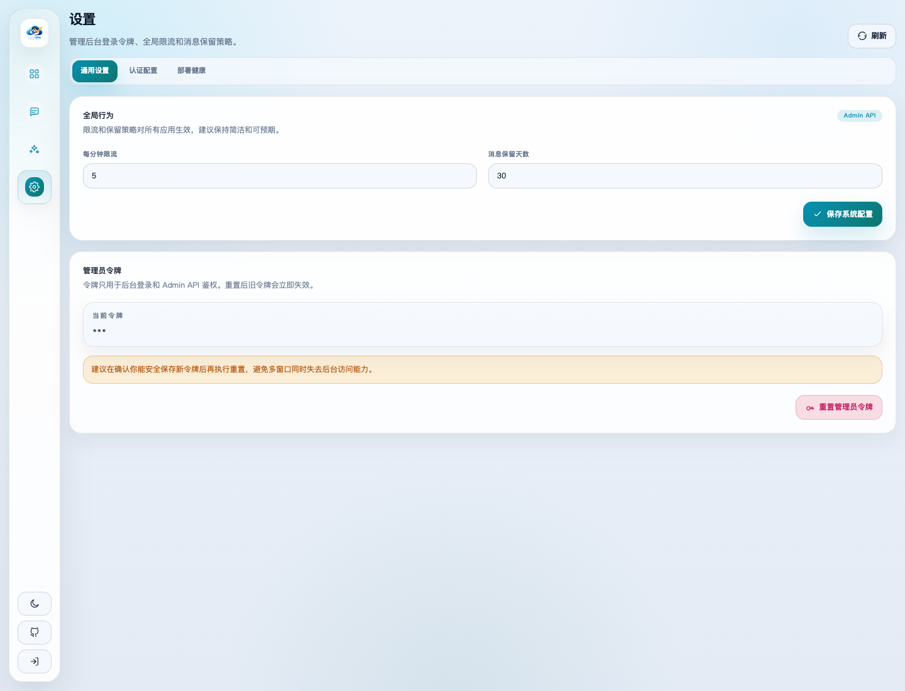</td>
  </tr>
  <tr>
    <td align="center">MCP 工具说明</td>
    <td align="center">MCP 客户端配置</td>
    <td align="center">全局设置与管理员令牌</td>
  </tr>
  <tr>
    <td>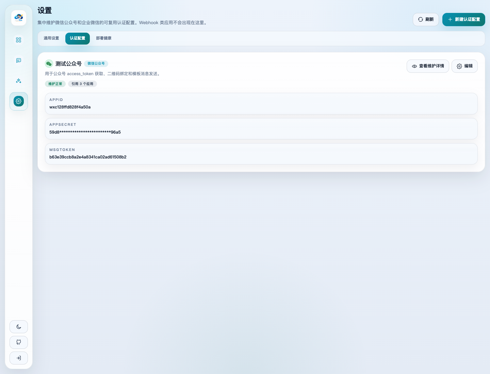</td>
    <td>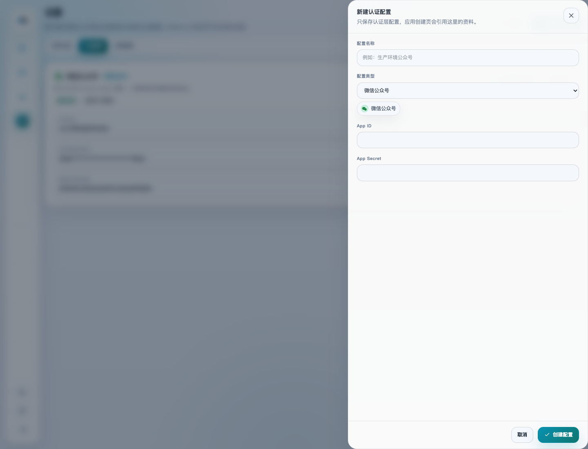</td>
    <td>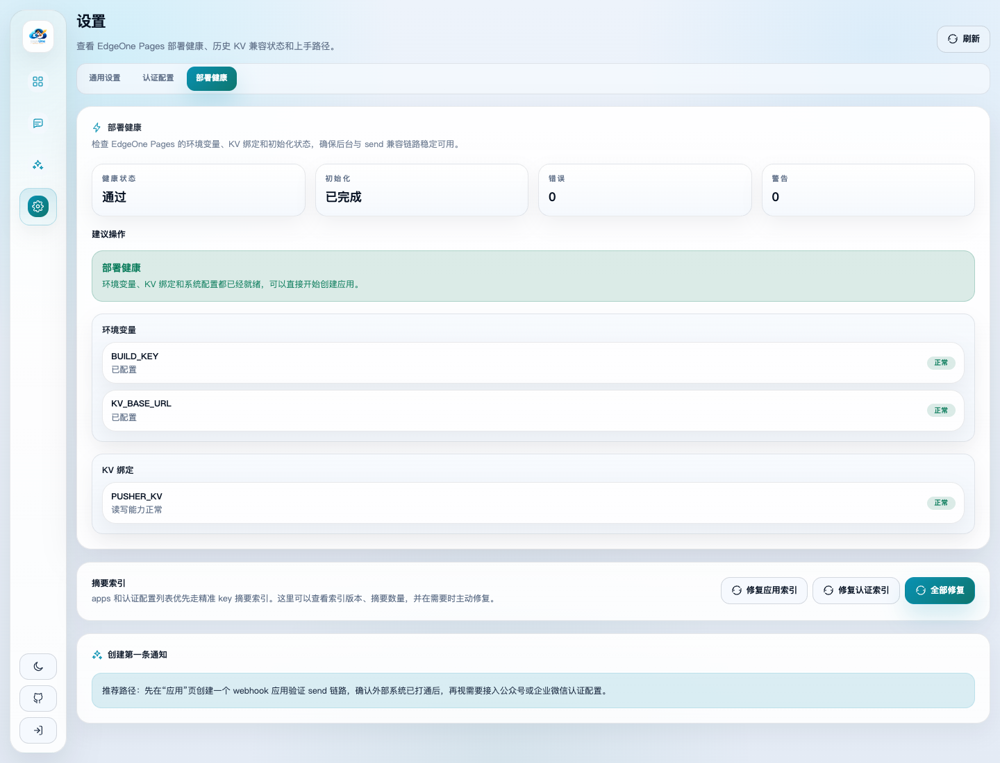</td>
  </tr>
  <tr>
    <td align="center">认证配置列表</td>
    <td align="center">认证配置新建面板</td>
    <td align="center">部署健康与索引检查</td>
  </tr>
</table>

---

## 核心功能

- **自托管免费微信推送**：适合个人、NAS、Home Assistant、服务器告警
- **标准 MCP Server**：可直接接入 Claude Code、Cursor、Codex、OpenCode 等 Agent / IDE
- **Webhook 风格 API**：一行 `curl` 就能发消息
- **多应用管理**：同一后台统一管理多个 appKey
- **订阅群发**：适合公众号订阅、群组通知、多人接收
- **多渠道能力**：微信公众号、企业微信、钉钉、飞书
- **可视化后台**：创建应用、复制 appKey、测试发送、查看消息历史
- **EdgeOne 一键部署**：无需单独买服务器

---

## 适用场景

- **HomeLab / 智能家居**：NAS 下载通知、Home Assistant 告警、路由器监控
- **开发运维**：CI/CD 通知、服务器监控、Docker 异常、错误提醒
- **自动化工作流**：RSS 订阅、价格监控、爬虫结果、签到脚本
- **Agent / IDE 工作流**：已知 appKey 时直接发消息；需要让 AI 自己查 appKey 或读后台工具时再加 Bearer Token

---

## 快速开始

### 1. 一键部署到 EdgeOne

1. 点击上方 **Deploy to EdgeOne**
2. 创建并绑定 1 个 KV 命名空间：`PUSHER_KV`
3. 设置构建参数：
   - Root: `/`
   - Output: `dist`
   - Build: `yarn build`
4. 配置环境变量：

| 变量名 | 必填 | 说明 |
|--------|------|------|
| `KV_BASE_URL` | 是 | 站点完整域名，例如 `https://your-domain.com` |
| `BUILD_KEY` | 是 | Node Functions 与 Edge Functions 共用的内部鉴权口令 |

> `BUILD_KEY` 只要求两端一致，建议设置为难猜的复杂字符串。

### 2. 初始化后台

1. 打开 `https://your-domain.com/admin/login`
2. 完成初始化，或使用已有管理员令牌登录
3. 进入后台 `应用` 页创建第一个 app
4. 在应用详情中复制 `AppKey` 和 `Send URL`

> 管理员令牌主要用于后台和 MCP 管理只读工具，不影响普通 `/send/{appKey}` 调用。

### 3. 发送第一条消息

```bash
curl "https://your-domain.com/send/{appKey}?title=部署成功&desp=你的 EdgeOne MCP Pusher 已上线"
```

如果你更喜欢 JSON：

```bash
curl -X POST "https://your-domain.com/send/{appKey}" \
  -H "Content-Type: application/json" \
  -d '{"title":"部署成功","desp":"你的 EdgeOne MCP Pusher 已上线"}'
```

---

## Webhook 使用教程

### Send Endpoint

- 发送地址：`https://your-domain.com/send/{appKey}`
- `appKey` 来自后台应用详情
- 同一个站点可以管理多个 app，每个 app 都有自己的 `appKey`

### 常用参数

| 参数 | 说明 |
|------|------|
| `title` | 必填，消息标题 |
| `desp` | 简单正文，最常用 |
| `content` | 扩展正文，复杂消息时使用 |
| `format` | `text / markdown / html` |
| `type` | `text / page`，`page` 会生成托管详情页 |
| `url` | 可选跳转链接 |
| `summary` | 可选摘要 |
| `template` | 可选模板预设 key |

### 最小示例

```bash
curl "https://your-domain.com/send/{appKey}?title=CPU告警&desp=CPU使用率超过90%"
```

### POST JSON 示例

```bash
curl -X POST "https://your-domain.com/send/{appKey}" \
  -H "Content-Type: application/json" \
  -d '{
    "title": "构建完成",
    "content": "# Build Success\n\n项目已经完成部署。",
    "format": "markdown"
  }'
```

### 网页详情页示例

```bash
curl -X POST "https://your-domain.com/send/{appKey}" \
  -H "Content-Type: application/json" \
  -d '{
    "title": "生产告警",
    "desp": "CPU 使用率超过 90%，请打开详情页查看上下文。",
    "type": "page"
  }'
```

> `GET` 适合轻量调用；复杂内容、长正文、Markdown / HTML 推荐用 `POST JSON`。

---

## MCP 使用教程

### MCP Endpoint

- `BASE_URL`：当前项目地址，例如 `https://your-domain.com`
- MCP 入口：`<BASE_URL>/mcp`
- 传输方式：`Streamable HTTP`
- 适配方向：`Claude Code`、`Cursor`、`Codex`、`OpenCode` 以及其他支持远程 MCP 的 Agent / IDE
- `/mcp` 是独立 MCP 入口，应直接走 Node Functions，不经过 Nuxt 页面路由

### 权限模型

```text
Workflow:
1. Set BASE_URL to your current project address, then use <BASE_URL>/mcp.
2. If you already know appKey, call send_message directly. No bearer token is required.
3. If you need apps_list, apps_get, message history, stats, or setup tools, reconnect with Authorization: Bearer <AT_...>.
4. Copy appKey from the admin Apps page or from the existing /send/{appKey} URL.
If sendType is "page", body is required.
```

匿名连接时，`tools/list` 只会看到：

- `send_message`

带管理员令牌后，才会额外看到：

- `apps_list`
- `apps_get`
- `messages_list`
- `messages_get`
- `stats_get`
- `setup_overview_get`

管理员请求头：

```text
Authorization: Bearer <AT_...>
```

### 客户端配置示例

#### Claude Code

匿名发送：

```bash
export BASE_URL="https://your-domain.com"
claude mcp add --transport http edgeone-mcp-pusher "$BASE_URL/mcp"
```

管理员模式：

```bash
export BASE_URL="https://your-domain.com"
export EDGEONE_MCP_ADMIN_TOKEN="AT_xxx"
claude mcp add --transport http edgeone-mcp-pusher-admin "$BASE_URL/mcp" \
  --header "Authorization: Bearer $EDGEONE_MCP_ADMIN_TOKEN"
```

#### Codex

匿名发送：

```bash
export BASE_URL="https://your-domain.com"
codex mcp add edgeone-mcp-pusher --url "$BASE_URL/mcp"
```

管理员模式：

```bash
export BASE_URL="https://your-domain.com"
export EDGEONE_MCP_ADMIN_TOKEN="AT_xxx"
codex mcp add edgeone-mcp-pusher-admin \
  --url "$BASE_URL/mcp" \
  --bearer-token-env-var EDGEONE_MCP_ADMIN_TOKEN
```

#### Cursor

匿名发送：

```json
{
  "mcpServers": {
    "edgeone-mcp-pusher": {
      "url": "https://your-domain.com/mcp"
    }
  }
}
```

管理员模式：

```json
{
  "mcpServers": {
    "edgeone-mcp-pusher-admin": {
      "url": "https://your-domain.com/mcp",
      "headers": {
        "Authorization": "Bearer ${env:EDGEONE_MCP_ADMIN_TOKEN}"
      }
    }
  }
}
```

#### OpenCode

匿名发送：

```json
{
  "mcp": {
    "edgeone-mcp-pusher": {
      "type": "remote",
      "url": "https://your-domain.com/mcp",
      "enabled": true
    }
  }
}
```

管理员模式：

```json
{
  "mcp": {
    "edgeone-mcp-pusher-admin": {
      "type": "remote",
      "url": "https://your-domain.com/mcp",
      "enabled": true,
      "headers": {
        "Authorization": "Bearer {env:EDGEONE_MCP_ADMIN_TOKEN}"
      }
    }
  }
}
```

### Tools 与权限

| Tool | 是否需要 Bearer | 说明 |
|------|------------------|------|
| `send_message` | 否 | 已知 `appKey` 时可直接发送 |
| `apps_list` | 是 | 列出 app 与 `appKey` |
| `apps_get` | 是 | 读取单个 app 的发送能力 |
| `messages_list` | 是 | 读取消息列表 |
| `messages_get` | 是 | 读取单条消息详情 |
| `stats_get` | 是 | 读取系统统计 |
| `setup_overview_get` | 是 | 读取初始化与索引概览 |

### send_message 最小 payload

```json
{
  "appKey": "APKxxxxxxxxxxxxxxxxxxxxxxxxxxxxx",
  "title": "Server Alert",
  "body": "CPU usage exceeded 80%",
  "sendType": "text"
}
```

字段说明：

- `appKey`：从后台「应用」页复制，或取现有 `/send/{appKey}` 的最后一段
- `title`：必填
- `body`：正文；`sendType=page` 时必填
- `sendType`：`text` 或 `page`
- `format`：可选 `text / markdown / html`
- `linkUrl`：可选跳转链接
- `summary`：可选摘要
- `templateKey`：可选模板 key

### 接入提示

- 大多数远程 MCP 客户端会自动处理 `initialize`、`notifications/initialized` 与 `tools/list`
- 你只需要保证 MCP 地址指向 `<BASE_URL>/mcp`
- 如果只需要发送消息，可以不配 Bearer Token
- 如果要让 Agent 自己发现 appKey 或读取后台信息，再补 `Authorization: Bearer <AT_...>`

### 可选安全白名单

如果你希望限制 `/mcp` 的访问来源，可配置以下环境变量：

| 变量名 | 说明 |
|--------|------|
| `MCP_ALLOWED_HOSTS` | 允许访问 `/mcp` 的 Host 白名单，逗号分隔，支持 `*.example.com` |
| `MCP_ALLOWED_ORIGINS` | 允许跨域访问 `/mcp` 的 Origin 白名单，逗号分隔，支持 `https://*.example.com` |

未配置时默认不限制生产 Host / Origin；本地开发仍只接受 loopback host。

---

## 集成示例

### 群晖 NAS 下载通知

```bash
curl "https://your-domain.com/send/{appKey}?title=下载完成&desp=${TR_TORRENT_NAME}"
```

### GitHub Actions 部署通知

```yaml
- name: 部署通知
  run: curl "https://your-domain.com/send/${{ secrets.WEBHOOK_KEY }}?title=部署成功&desp=项目已上线"
```

### Home Assistant 告警

```yaml
notify:
  - name: edgeone_mcp_pusher
    platform: rest
    resource: https://your-domain.com/send/{appKey}
    method: POST
    data:
      title: "{{ title }}"
      desp: "{{ message }}"
```

### 服务器监控

```bash
CPU_USAGE=$(top -bn1 | grep "Cpu(s)" | awk '{print $2}')
[ ${CPU_USAGE%.*} -gt 80 ] && curl "https://your-domain.com/send/{appKey}?title=CPU告警&desp=使用率${CPU_USAGE}%"
```

---

## 常见问题

**Q: 它和 Server 酱最大的区别是什么？**  
A: 这是自托管方案，数据和 appKey 都在你自己的 EdgeOne 账号里，而且额外提供标准 MCP Server 给 Agent / IDE 使用。

**Q: Webhook 和 MCP 有什么区别？**  
A: Webhook 适合脚本和服务直接调用；MCP 适合让 Claude Code、Cursor、Codex 这类客户端通过标准协议调用 `send_message`，并在带管理员 Bearer Token 时继续使用 app/消息/统计工具。

**Q: appKey 从哪里拿？**  
A: 去后台「应用」页复制 AppKey，或者直接从现有 `https://your-domain.com/send/{appKey}` 里取最后一段。

**Q: 管理员令牌 AT_... 是做什么的？**  
A: 主要用于后台登录，以及 MCP 的后台只读工具；普通 `/send/{appKey}` 调用不依赖它。

**Q: EdgeOne 免费额度够用吗？**  
A: 对个人通知、家庭告警、轻量自动化场景通常足够；如果流量和消息量持续增长，再考虑独立资源即可。

---

## 开源协议

GPL-3.0 License

---

**关键词**：EdgeOne | MCP | 自托管免费微信推送 | Agent | IDE | Webhook | WeChat push | multi-app | 订阅群发 | Claude Code | Cursor | Codex | OpenCode
